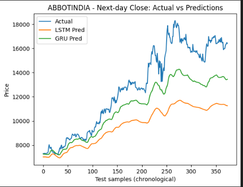

# 📈 Stock Price Prediction using GRU and LSTM

## 📌 Project Overview
This project predicts the **next-day closing price** for a selected NSE stock using deep learning models — **GRU** and **LSTM** — both of which are types of Recurrent Neural Networks (RNNs) designed for time-series forecasting.

The project compares the performance of GRU and LSTM models to determine which architecture provides better prediction accuracy.

---

## 📂 Dataset
- **Source:** Kaggle Dataset: [NSE Top 100 Stocks](https://www.kaggle.com/datasets/kmldas/nse-top-100-stocks)
- **Download using `kagglehub`:**
```python
import kagglehub

# Download latest version of the dataset
path = kagglehub.dataset_download("kmldas/nse-top-100-stocks")
print("Path to dataset files:", path)


=================================================================================================================================


Selected Stock: ABBOTINDIA

Date Range: 2010-01-08 to 2020-10-01

Frequency: Daily OHLCV (Open, High, Low, Close, Volume, VWAP)

🛠 Preprocessing Steps
Select a single stock (ABBOTINDIA) from the dataset.

Date parsing & sorting — Convert Date column to datetime and sort ascending.

Duplicate date handling — Aggregate OHLCV:

Open = first

High = max

Low = min

Close = last

Volume = sum

VWAP = mean

Feature selection — Keep only:

mathematica
Copy
Edit
Open, High, Low, Close, Volume, VWAP
Target creation — Next-day Close:

ini
Copy
Edit
Target = Close.shift(-1)
Train/Test split — Date-based:

Train: 2010–2018

Test: 2019–2020

Scaling — MinMaxScaler fitted on train data only (to avoid leakage).

Sequence creation — Sliding window of 60 days → predict next day.

🤖 Models Used
LSTM Model Architecture:
LSTM (64 units, return_sequences=True)

Dropout (0.2)

LSTM (32 units)

Dense (1 output neuron)

Loss = MSE, Optimizer = Adam(1e-3)

GRU Model Architecture:
GRU (64 units, return_sequences=True)

Dropout (0.2)

GRU (32 units)

Dense (1 output neuron)

Loss = MSE, Optimizer = Adam(1e-3)

Training Strategy:

EarlyStopping on validation loss (patience=10)

📊 Results
LSTM Performance:
RMSE: 3606.063

MAE: 3061.632

R²: -0.115

MAPE: 21.52%

Accuracy ≈ 78.48%

GRU Performance:
RMSE: 2012.234

MAE: 1640.207

R²: 0.653

MAPE: 11.33%

Accuracy ≈ 88.67%

Winner: ✅ GRU (Better RMSE, MAE, R², Accuracy)

📈 Key Learnings
Date-based split prevents lookahead bias.

OHLCV aggregation is critical when duplicates exist.

Scaling only on train set avoids future data leakage.

GRU outperformed LSTM for this dataset due to simpler gating and better convergence.

🚀 Possible Improvements
Try different window sizes (30, 90 days).

Add technical indicators (SMA, EMA, RSI, MACD).

Use log-returns instead of raw prices.

Perform walk-forward validation.

Evaluate directional accuracy (up/down prediction) alongside price accuracy.

💡 Usage
Download the dataset from Kaggle using kagglehub or manually.

Run preprocessing script to clean and prepare the data.

Train both GRU and LSTM models.

Compare results using RMSE, MAE, R², MAPE, and Accuracy.


============================================================================================
## 📉 Prediction vs Actual Graph
## 📉 Prediction vs Actual


